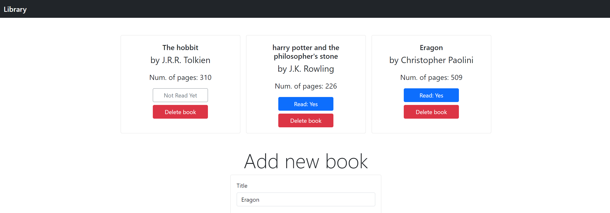

# Library app

> app to display a virtual library.

Library app that allows users to store books in a virtual library. Books added to the library can have a title, author, num of pages, a button to indicate if have read it, and a button to delete the book.

## Built With

- Javascritp 
- HTML 
- Bootstrap

## Live Demo

[Live Demo Link](https://sjcco.github.io/library/)

## Getting Started
-clone the project with the instructions below or click on the live demo.

To get a local copy up and running follow these simple example steps.

### Prerequisites
-Internet connection
-A browser

### Setup

-Clone the project with `git clone https://github.com/sjcco/library`

### Usage

-Open index.html in your browser

## Authors

👤 **Eri-Ngozi Okereafor**

- GitHub: [@errea](https://github.com/errea)
- Twitter: [@Erreakay](https://twitter.com/Erreakay)

👤 **Carlos Campos**

- GitHub: [@sjcco](https://github.com/sjcco)
- Twitter: [@CarlosCamposO](https://twitter.com/CarlosCamposO)

## 🤝 Contributing

Contributions, issues, and feature requests are welcome!

Feel free to check the [issues page](https://github.com/sjcco/library/issues/).

## Show your support

Give a ⭐️ if you like this project!

## Acknowledgments

- Hat tip to anyone whose code was used
- Inspiration
- etc

## 📝 License

This project is [MIT](lic.url) licensed.
